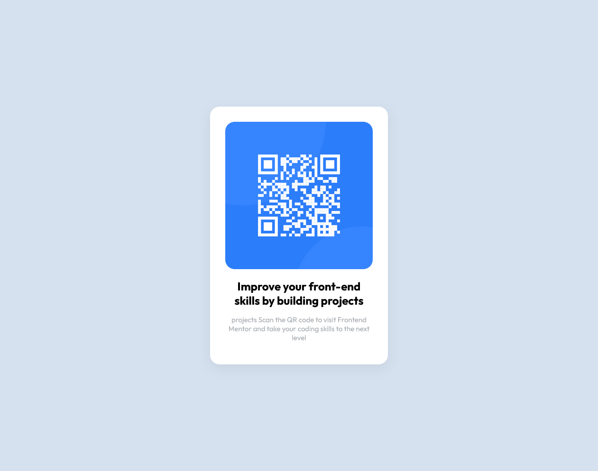

## Solution

## Table of contents

- [Overview](#overview)
  - [Screenshot](#screenshot)
  - [Links](#links)
- [My process](#my-process)
  - [Built with](#built-with)
  - [What I learned](#what-i-learned)
  - [Continued development](#continued-development)
  - [Useful resources](#useful-resources)
- [Author](#author)
- [Acknowledgments](#acknowledgments)

### Links
- Live Site URL: [site](https://danielcodex.github.io/QR-code-component/)

### Built with
- HTML
- CSS

### What I learned
1. Mostly BEM naming convention
2. Collection of really good looking box shadows [getcssscan.com](https://getcssscan.com/css-box-shadow-examples)

### Useful resources
I focus most of my time on how to structure the layout on a web page. and i am seeing the result of it
- [learning responsive layout](https://courses.kevinpowell.co/conquering-responsive-layouts) - I am still learning. really good course about how to make a responsive layout
- [flexboxfroggy.com](https://flexboxfroggy.com) - for learning about flexbox
- [flexboxdefense.com](http://www.flexboxdefense.com/) - also for learning flexbox
- [flexboxzombie](https://mastery.games/flexboxzombies/) - still learning this

## Author

- Website - [danielcodex.com](https://www.danielcodex.com)
- Frontend Mentor - [@DanielCodex](https://www.frontendmentor.io/profile/DanielCodex)
- Twitter - [@Daniel_codex](https://www.twitter.com/Daniel_codex)

